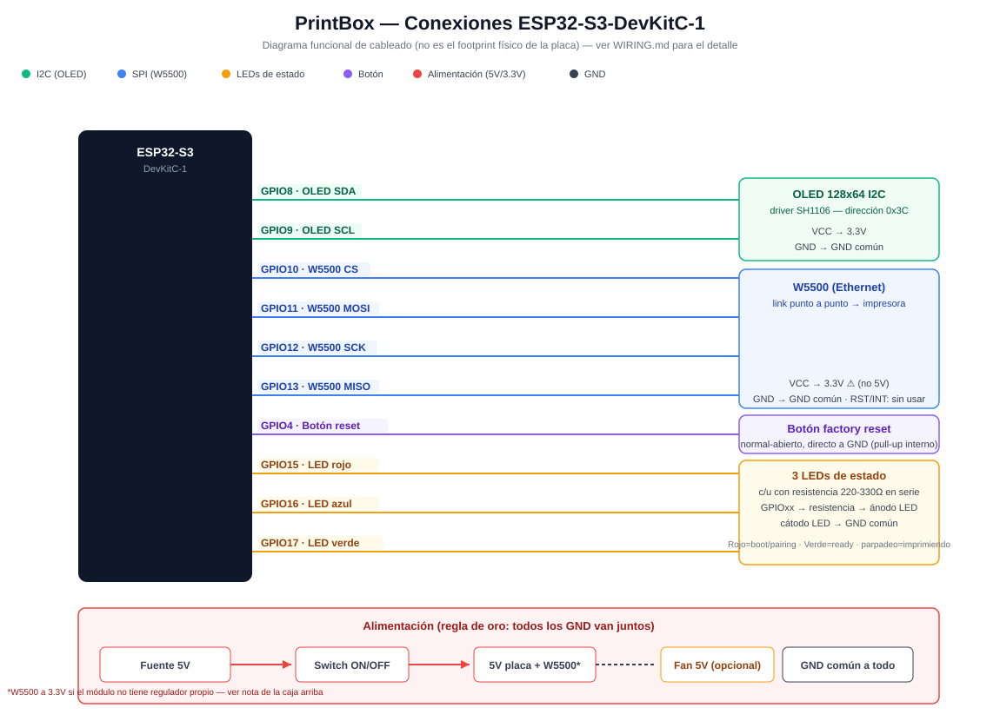
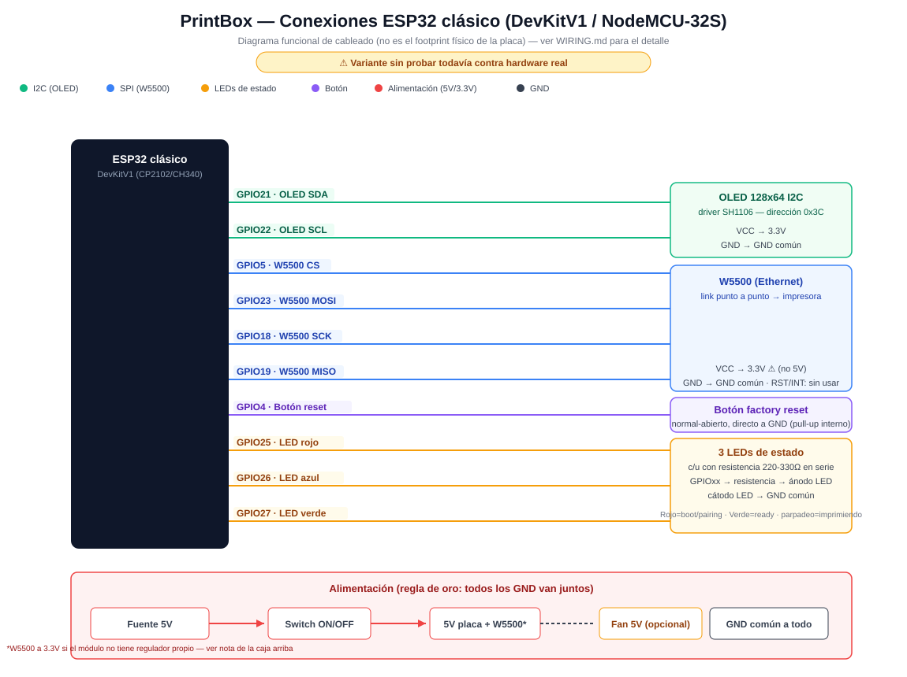

# PrintBox — Conexiones de hardware

Dos variantes de placa soportadas por el mismo firmware (ver
`platformio.ini`, envs `esp32-s3` / `esp32-classic`, y los bloques
`#if defined(PRINTBOX_BOARD_CLASSIC)` en `src/main.cpp`):

- **ESP32-S3-DevKitC-1** — la placa ya probada contra hardware real (ver
  `README.md`).
- **ESP32 "clásico"** (DevKitV1 / NodeMCU-32S con puente USB-serie CP2102 o
  CH340, sin USB nativo) — pines nuevos, **todavía no probados contra
  hardware real**. Se agregaron porque en el ESP32 clásico los GPIO 6-11
  están reservados para la flash SPI interna (los que usa la S3 para
  OLED/W5500) y usarlos ahí cuelga o directamente no bootea la placa — no
  es opcional cambiarlos, es la razón de que existan dos columnas en las
  tablas de abajo.

Todos los pines salen de las `#define` reales en `src/main.cpp` — si el día
de mañana se cambia un pin en el firmware, hay que actualizar este archivo
también (no se generan solos).

## Diagramas de conexión

**ESP32-S3-DevKitC-1:**



**ESP32 clásico (DevKitV1 / NodeMCU-32S):**



Son diagramas funcionales (qué pin va a qué componente), no el footprint
físico real de cada placa — para eso, las tablas de cada sección de abajo
siguen siendo la referencia exacta.

**Regla de oro: todos los GND van juntos.** El GND del ESP32, del W5500, del
OLED, de cada LED, del botón, del switch y del ventilador (si lo controlás
por MOSFET) tienen que compartir la misma referencia — si a alguno le falta
el GND común, se comporta raro o no anda, aunque el resto esté bien cableado.

---

## 1. Ethernet W5500 (link punto a punto hacia la impresora)

| W5500 (módulo) | ESP32-S3 | ESP32 clásico |
|---|---|---|
| CS   | GPIO10 | GPIO5 |
| SCK  | GPIO12 | GPIO18 |
| MISO | GPIO13 | GPIO19 |
| MOSI | GPIO11 | GPIO23 |
| VCC  | **3.3V** ⚠️ | **3.3V** ⚠️ |
| GND  | GND | GND |
| RST / INT | sin usar — se pueden dejar sin conectar | sin usar — se pueden dejar sin conectar |

(El pinout del clásico es el estándar VSPI que usa casi cualquier tutorial
de ESP32+W5500 — sin pines de strapping de boot de por medio.)

⚠️ El chip W5500 es de 3.3V. Muchos módulos chinos genéricos tienen
regulador propio y tienen a veces un pin "5V" que sí toleran, pero **no
asumas nada** — fijate el silkscreen/rótulo de tu módulo puntual antes de
darle 5V. Si tiene un solo pin de alimentación sin aclarar, andá a 3.3V
seguro.

---

## 2. Pantalla OLED 128x64 (I2C, driver SH1106)

| OLED | ESP32-S3 | ESP32 clásico |
|---|---|---|
| SDA | GPIO8 | GPIO21 |
| SCL | GPIO9 | GPIO22 |
| VCC | 3.3V | 3.3V |
| GND | GND | GND |

**ESP32-S3**: no mover SDA/SCL de 8/9 — ya se probó cambiarlos y el scan
I2C dejó de detectar el módulo (queda anotado en el código, no tocar sin
re-testear).

**ESP32 clásico**: 21/22 son los pines default de `Wire.h` en esta placa
(el estándar de facto), pero todavía sin confirmar contra hardware real de
esta variante puntual — si el scan I2C no detecta el módulo ahí, es el
primer lugar por donde empezar a debuguear (misma lógica que la nota de la
S3 arriba).

Dirección I2C: `0x3C`.

---

## 3. Los 3 LEDs de estado (rojo / azul / verde — discretos, no un módulo RGB)

Cada LED es independiente, con su propia resistencia limitadora en serie
hacia GND (no llevan protocolo, son 3 salidas digitales simples):

```
GPIOxx ──── resistencia 220-330Ω ──── LED ánodo (+)
                                       LED cátodo (−) ──── GND
```

| Color | ESP32-S3 | ESP32 clásico |
|---|---|---|
| Rojo  | GPIO15 | GPIO25 |
| Azul  | GPIO16 | GPIO26 |
| Verde | GPIO17 | GPIO27 |

(En el clásico, 15/16/17 no sirven: GPIO15 es un pin de strapping de boot
y GPIO16/17 suelen estar reservados para PSRAM/flash en variantes WROVER
de esta placa — 25/26/27 son GPIO de uso general sin esas restricciones.)

Qué significa cada estado (por si sirve para verificar el cableado con el
device prendido):

| Estado del device | LEDs |
|---|---|
| Booting / Pairing / Conectando | Rojo + Azul parpadeando juntos (lento, ~400ms) |
| Ready | Verde fijo |
| Imprimiendo | Verde parpadeando rápido (~150ms) |
| Error | Rojo fijo |
| Reset factory en curso (botón mantenido) | Los 3 parpadeando juntos |

---

## 4. Botón de reset (factory reset)

Pulsador normal-abierto, **directo entre GPIO4 y GND** — nada más.

```
GPIO4 ────[ botón ]──── GND
```

No lleva resistencia externa: el firmware usa el pull-up interno del ESP32
(`INPUT_PULLUP`). Mantenido apretado ~5 segundos borra el pairing guardado
(WiFi + token) y el device vuelve a modo setup (AP `PrintBox-Setup`).

---

## 5. Switch de encendido / apagado general

Esto no es un pin del ESP32 — es un interruptor mecánico **en la línea de
alimentación**, antes de que la energía le llegue a la placa. Corta todo de
una: ESP32, W5500, OLED, LEDs y ventilador (si el fan también cuelga del
mismo riel de 5V, que es lo normal).

```
Fuente 5V (+) ──── [ switch ON/OFF ] ──── pin 5V de la placa (S3 o clásico)
Fuente 5V (−) ──────────────────────────── GND de la placa
```

Usá un switch dimensionado para la corriente total (ESP32 + W5500 + OLED +
fan normalmente no pasan de ~500mA-1A juntos, pero fijate el consumo de tu
fan puntual). Va en la línea **positiva** (+5V), no en GND.

---

## 6. Ventilador 5V (agregado)

El firmware hoy **no tiene un pin dedicado al fan** — hay dos formas de
cablearlo, elegí según si lo querés siempre prendido o controlado por
software:

### Opción A — Siempre encendido (recomendada, más simple)

Directo al riel de 5V, sin pasar por ningún GPIO. Un GPIO del ESP32 no
puede entregar la corriente que pide un fan de todas formas, así que para
"refrigeración constante" esta es la forma correcta de hacerlo sin
componentes extra:

```
Fan (+) ──── 5V (después del switch de la sección 5)
Fan (−) ──── GND
```

### Opción B — Controlado por software (on/off o solo mientras imprime)

Necesita un transistor/MOSFET como driver — un GPIO no puede manejar el fan
directo:

```
GPIO14 ──── resistencia 1kΩ ──── Gate del MOSFET (ej. 2N7000 / IRLZ44N)
                                  (o Base de un NPN tipo S8050)

Fan (+) ────────────────────────────────── 5V directo
Fan (−) ──── Drain del MOSFET (o Colector del NPN)
             Source del MOSFET (o Emisor del NPN) ──── GND

Diodo flyback (1N4007 o similar) en paralelo con el fan,
cátodo apuntando hacia el +5V
```

GPIO14 está libre en las dos variantes (no lo usa nada más del firmware,
ni la S3 ni el clásico). El diodo flyback es
importante: el fan es un motor, y sin el diodo el pico de tensión inductiva
al apagarlo puede ir dañando el transistor (y en el peor caso el ESP32) con
el uso.

Si en algún momento querés que lo maneje el firmware (por ejemplo prendido
solo durante `PRINTING`, o con un umbral), avisá y se agrega
`#define FAN_PIN 14` + la lógica en `main.cpp` — con la Opción A cableada
así, no hace falta tocar el firmware para nada.

---

## Pinout resumido — ESP32-S3

| GPIO | Uso |
|---|---|
| 4  | Botón factory reset (a GND) |
| 8  | OLED SDA |
| 9  | OLED SCL |
| 10 | W5500 CS |
| 11 | W5500 MOSI |
| 12 | W5500 SCK |
| 13 | W5500 MISO |
| 14 | *(libre — reservado para fan si se controla por software, Opción B)* |
| 15 | LED rojo |
| 16 | LED azul |
| 17 | LED verde |
| 5V | Riel de alimentación general (switch, W5500 si tu módulo lo acepta, fan) |
| 3.3V | OLED, W5500 (según módulo) |
| GND | Común a todo lo de arriba |

## Pinout resumido — ESP32 clásico (DevKitV1/NodeMCU-32S)

⚠️ No probado todavía contra hardware real (ver aviso al principio de este
archivo) — pines elegidos para evitar los reservados de flash (6-11) y los
de strapping de boot (0/2/5-timing/12/15), pero sin confirmar en una placa
física.

| GPIO | Uso |
|---|---|
| 4  | Botón factory reset (a GND) |
| 5  | W5500 CS |
| 14 | *(libre — reservado para fan si se controla por software, Opción B)* |
| 18 | W5500 SCK |
| 19 | W5500 MISO |
| 21 | OLED SDA |
| 22 | OLED SCL |
| 23 | W5500 MOSI |
| 25 | LED rojo |
| 26 | LED azul |
| 27 | LED verde |
| 5V | Riel de alimentación general (switch, W5500 si tu módulo lo acepta, fan) |
| 3.3V | OLED, W5500 (según módulo) |
| GND | Común a todo lo de arriba |
